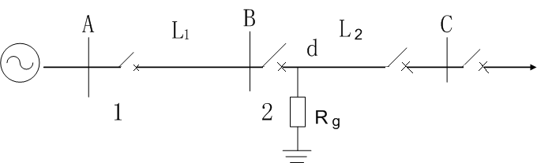
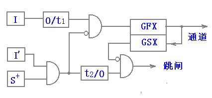
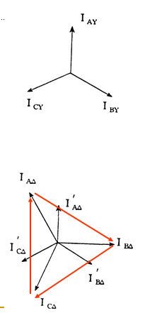
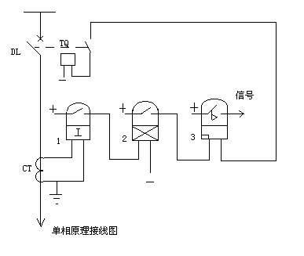
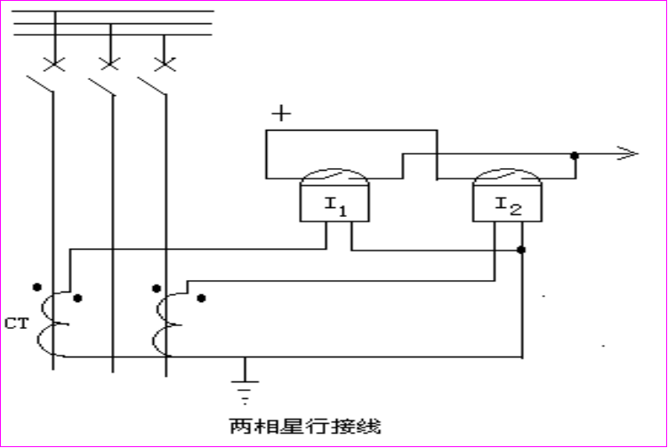
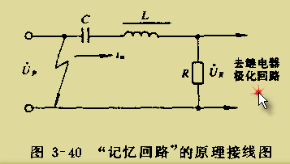

[TOC]

## 讨论课思考题

### 1. 试说明常见的基于单端电气量的保护原理有哪些？阐述它们是如何保证保护的选择性和灵敏性以及其在电力系统中的适用范围？

　　常见的单端电气量的保护原理包括过电流保护、零序电流保护和距离保护。由于它们的 Ⅰ 段均为瞬时速动但不能保护线路全长，为了能可靠切除故障同时又能保证保护的选择性，需要增加相应保护 Ⅱ 段与下条线路的相应Ⅰ段进行定值和时限的配合。保证了保护的选择性后，需要按照系统最小运行方式进行保护灵敏度校验，若灵敏度不满度要求，则需采取相应措施使之满足，比如过电流保护 Ⅱ 段灵敏度不满足要求时，可与相邻线路 Ⅱ 段配合，以提高灵敏度使之满足要求,但需要将时间再提高一级，以保护选择性。

　　适用范围：过电流保护一般用于 35kV 及以下电压等级配电网线路主保护，零序电流保护和距离保护一般用于 110kV 及以上电压等级电网的后备保护。

### 2. 讨论短路点过渡电阻对距离保护的影响及防止方法。

- **单侧电源网络：**单侧电源网络上，过渡电阻 $R_t$ 使继电器的测量阻抗值增大，阻抗角变小，保护范围缩小；有时也会导致保护无选择性动作。

  - 短路点距保护安装处越近，影响越大，反之影响越小；
  - 保护装置整定值越小，受过渡电阻影响越大。

  

- **双侧电源网络：**双侧电源线路上，过渡电阻与系统的短路电流有关，可能呈感性也可能呈容性，会使保护误动或拒动。一般而言，阻抗继电器动作特性在 $+R$ 轴方向上所占面积越大，受过渡电阻影响越小。

  

- **防止方法：**

  - 采用能容许较大的过渡电阻而不致拒动的阻抗继电器，可防止过渡电阻对继电器工作的影响。
  - 利用所谓瞬时测量回路来固定阻抗继电器的动作。

### 3. 零序电流保护灵敏 I 段和不灵敏 I 段保护的差别与使用条件是什么? 限时零序电流速断保护的灵敏系数不满足要求时所采取的措施是什么?

　　灵敏 I 段保护和不灵敏 I 段保护是分别按不同的原则进行整定，灵敏 I 段的整定值较小，保护范围较大，而不灵敏 I 段的整定值较大，保护范围较灵敏 I 段小些。

**使用条件：**

　　灵敏 I 段的主要任务是对全相运行状态下的接地故障起保护作用，具有较大的保护范围，而当单相自动重合闸起动时则将其自动闭锁，需待恢复全相运行时才能重新投入，即灵敏I段作为全相运行、发生接地故障时的接地保护，非全相运行时需退出运行；

　　不灵敏 I 段是在单相重合闸过程中，其他两相又发生接地故障时用以弥补失去灵敏 I 段的缺陷，尽快地将故障切除，即作为非全相运行、发生接地故障时的接地保护，不灵敏 I 段也能反应全相运行状态下的接地故障，只是其保护范围较灵敏 I 段小些。

**灵敏系数不满足要求时所采取的措施：**

　　使零序 Ⅱ 段保护与下一条线路的零序 Ⅱ 段相配合，时限再抬高一级，取为 0.7-1.2s ；

　　保留 0.5s 的零序 Ⅱ 段，同时再增加一个按躲过保护线路末端单相或两相接地短路时出现的最大零序电流整定的保护，这样保护装置中，就具有两个定值和时限均不相同的零序 Ⅱ 段。一个是定值较大，能在正常运行方式和最大运行方式下，以较短的延时切除本线路上所发生的大部分接地故障；另一个则具有较长的延时，它能保证在各种运行方式下线路末端接地短路时保护装置具有足够的灵敏系数；

　　从系统接线的全局考虑改用接地距离保护。

### 4. 什么是振荡闭锁？讨论为什么距离保护中要装设振荡闭锁而电流保护中不需要？

　　并联运行的电力系统或发电厂之间出现功率角大范围周期性变化的现象称为电力系统振荡。在系统振荡时要采取必要的措施，防止保护因测量元件动作而误动作，这种用来防止系统中振荡时保护误动作的措施，称为振荡闭锁。因电流保护、电压保护和功率方向保护等一般都只应用在电压等级较低的中低压配电系统，而这些系统出现振荡的可能性很小。故一般不需要振荡闭锁。距离保护一般用在较高电压等级的电力系统。系统出现振荡的可能性较大，保护误动造成的损失严重，所以必须考虑振荡闭锁问题。

### 5. 讨论高频闭锁方向保护为什么需要高、低定值的两个启动元件以及延时 t1 和 t2 的作用。

- 因为采用两个灵敏度不同的启动元件，灵敏度高的启动发信机发闭锁信号，灵敏度低的启动跳闸回路，从而保证在外部故障时，远离故障点侧启动元件开放跳闸时，近故障点侧启动元件肯定能启动发信机发闭锁信号。

- 延时 t1 的作用：区外故障切除后，近故障端保护继续发讯 t1 时间，以闭锁对端的保护，防止近故障端 L1 先返回，远故障端 S+ 、 L2 后返回引起远故障端保护的误动作。

  延时 t2 的作用：区外故障时，远故障端 S+ 、 L2 动作，需经 t2 延时才能出口，以保证可靠收到近故障侧的闭锁信号。

### 6. 讨论纵联保护和阶段式保护的区别并说明纵联比较式保护与纵联差动式保护的基本原理。

**区别：**

　　纵联保护与阶段式保护的根本差别在于，阶段式保护仅检测、反应保护安装处一端的电气量，其无延时的速动段（即第 Ⅰ 段）不能保护全长，只能保护线路的一部分，另一部分则需要依靠带有一定延时的第 Ⅱ 段来保护；而纵联保护通过通信联系，同时反应被保护线路两端的电气量，无需延时配合就能够区分出区内故障与区外故障，因而可以实现线路全长范围内故障的无时限切除。

　　纵联比较式保护通过比较线路两端故障功率方向或故障距离来区分区内故障与区外故障，纵联比较式保护通过比较线路两端故障功率方向或故障距离来区分区内故障与区外故障，当线路两侧的正方向元件或距离元件都动作时，判断为区内故障，保护立即动作跳闸；当任意一侧的正方向元件或距离元件不动作时，就判断为区外故障，两侧的保护都不跳闸。

　　纵联差动保护通过直接比较线路两端的电流或电流相位来判断是区内故障还是区外故障，在线路两侧均选定电流参考方向由母线指向被保护线路的情况下，区外故障时线路两侧电流大小相等，相位相反，其相量和或瞬时值之和都等于零；而在区内故障时，两侧电流相位基本一致，其相量和或瞬时值之和都等于故障点的故障电流，量值很大。所以通过检测两侧的电流的相量和或瞬时值之和，就可以区分区内故障与区外故障，区内故障时无需任何延时，立即跳闸；区外故障，可靠闭锁两侧保护，使之均不动作跳闸。

### 7. 讨论在依靠电力线载波通道的线路上实现纵联电流差动保护较实现方向比较式纵联保护的主要困难是什么？前者保护原理的主要优点是什么？

**主要困难：**

　　线路纵联电流差动保护既比较线路两侧电流的大小又比较电流的相位，要求进行相量比较，传输两端的电流相量时，对传输设备的传输容量和传输速率都有较高要求，利用电力线载波通道很难满足以上的技术要求，因而纵联电流差动保护原理主要应用在发电机、变压器、母线等集中参数元件上，并在超短距离输电线导引线保护下才在远距离输电线路上获得越来越多应用。但是电力线载波通道很难满足以上技术要求，只能传递简单的逻辑信号，因此通常利用载波通道传递两端电流的相位信息，构成纵联电流相位差动保护。

**主要优点：**

　　纵联电流差动保护既比较线路两侧电流的大小，又比较电流的相位，即进行相量比较或瞬时值比较。由于利用了电流的全部信息，并可以采取比率制动等措施，它在可靠性和灵敏性等方面均优于电流相位纵联差动保护。此外由于纵联电流差动保护可以分相构成，具有天然的选相能力，因此不必与选相元件配合，简化了逻辑，提高了可靠性。

### 8. 什么是励磁涌流，其特点有哪些，讨论防止由励磁涌流引起保护误动作的措施。

**励磁涌流：**电压突然增加（空载合闸、故障消失电压恢复）的暂态过程中，磁通不能突变，产生暂态磁通，可能导致变压器严重饱和，产生很大的励磁电流，可达到励磁电流的 6~8 倍，称之为励磁涌流。励磁涌流完全是差动电流，可能导致差动保护误动。

**特点：**

 - 含有很大的非周期分量。
- 波形偏向时间轴一侧，并出现间断。
- 含有大量的高次谐波分量，以二次谐波为主。

**防误动措施：**

- 采用具有速饱和铁芯的差动继电器。
- 采用间断角鉴别方法闭锁差动保护。
- 采用不受涌流影响的主保护。

### 9. 高频闭锁方向保护动作跳闸的条件是什么？如果通道遭到破坏，当内部故障和外部故障时，保护的工作会受到何影响?

**高频闭锁方向保护动作跳闸的条件：**高频闭锁方向保护动作跳闸判据是本端保护方向元件判定为正方向故障且收不到闭锁信号。

**如果通道遭到破坏，当内部故障和外部故障时，保护的工作会受到的影响：**    

- 在外部故障情况下，如果远故障点（功率方向为正）一端收不到对端发来的高频电流，保护将会误跳闸。
- 当线路内部故障时，两端保护能够正确跳闸。

### 10. 两侧电源线路自动重合闸方式有哪些？讨论在什么条件下重合闸可以不考虑两侧电源的同期问题？

- **自动重合闸方式有：**快速自动重合闸、非同期重合闸、解列重合闸与自同期重合闸、检查双回线路另一回线电流的重合闸和具有同期检定和无电压检定的重合闸等。
- **不需要考虑两侧电源同期问题的具体情况有：**被保护线路两侧的电源之间有多条线路相连，跳开一条电路不会使两侧的电源失去同步。
- 被保护线路两端交换功率较小，即两端的的电源与负荷都比较平衡，跳开被保护线路后两侧系统都能够保持同步，且频率基本保持不变。
- 一侧电源容量较小，非同期重合闸造成的冲击电流较小，不会破坏电气设备，重合后很容易将其拉入同步时。
- 非同期重合闸造成的冲击电流不会破坏系统稳定性及电气设备时。

### 11. 讨论为什么具有制动特性的差动继电器能够提高保护的灵敏性。

　　由互感器变比不一致和互感器传变误差产生的不平衡电流可知，流入差动继电器的不平衡电流与变压器外部故障时的穿越电流有关。穿越电流越大，不平衡电流也就越大。具有制动特性的差动继电器正是利用这个特点，在差动继电器中引入一个能够反映变压器穿越电流大小的制动电流，继电器的动作电流不再是按躲过最大穿越电流整定，而是根据实际的穿越电流自动调整，故可以提高保护的灵敏性。

### 12. 变压器接线组别对变压器纵联差动保护有什么影响？补偿措施有哪几种？请以连接组别为 YNd11 的变压器为例进行说明。

**影响：**三相变压器常常采用 YNd11 的接线方式，正常运行时变压器三角形侧的相电流相位超前星形侧相电流 30° 。由于该电流相位差会使得变压器正常运行或区外故障时计算得到的差流不为零，因此必须采用相应的接线方式以消除二次侧电流相位不同而引起的不平衡电流。

**补偿措施：**

- $Y\to\Delta$ 变换：

  $Y$ 侧电流互感器采用 $\Delta$ 接线， $\Delta$ 侧电流互感器采用星形接线。 $Y$ 侧二次电流按下式进行变换：
  $$
  \begin{equation}
      \left\{
          \begin{array}{l}
              \dot{I}_{aY}=(\dot{I}_{aY}^{'}-\dot{I}_{bY}^{'})/\sqrt{3} \\
               \dot{I}_{bY}=(\dot{I}_{bY}^{'}-\dot{I}_{cY}^{'})/\sqrt{3} \\
                \dot{I}_{cY}=(\dot{I}_{cY}^{'}-\dot{I}_{aY}^{'})/\sqrt{3} \\
          \end{array}
      \right.
  \end{equation}
  $$

- $\Delta\to Y$ 变换：

    　　$Y$  侧电流互感器采用星形接线， $\Delta$ 侧电流互感器采用 $\Delta$ 形接线。将 $\Delta$ 侧电流做一个反相序的两相电流之差。为求得零序电流的平衡，将 $Y$ 侧电流减去零序电流。
  $$
  \begin{equation}
        \left\{
            \begin{array}{l}
                \dot{I}_{a\Delta}=(\dot{I}_{A\Delta}-\dot{I}_{C\Delta})/\sqrt{3} \\
                 \dot{I}_{b\Delta}=(\dot{I}_{B\Delta}-\dot{I}_{A\Delta})/\sqrt{3} \\
                  \dot{I}_{c\Delta}=(\dot{I}_{C\Delta}-\dot{I}_{B\Delta})/\sqrt{3} \\
            \end{array}
        \right.
    \end{equation}
  $$
    　　采用 $\Delta\to Y$ 相位补偿的新方法后，由于 $Y$ 侧没有进行两相电流差的计算，变压器空载合闸时各相有涌流时其特征都很明显，故需要在差流计算中消除接地零序电流的影响，即各相电流都要减去零序电流。在有涌流及区外故障时闭锁保护更加可靠，故障相涌流很小，可以做到故障相快跳。
  $$
  \begin{equation}
        \left\{
            \begin{array}{l}
                \dot{I}_{aY}=(\dot{I}_{AY}-\dot{I}_{0}^{Y})/\sqrt{3} \\
                 \dot{I}_{bY}=(\dot{I}_{BY}-\dot{I}_{0}^{Y})/\sqrt{3} \\
                  \dot{I}_{cY}=(\dot{I}_{CY}-\dot{I}_{0}^{Y})/\sqrt{3} \\
            \end{array}
        \right.
    \end{equation}
  $$

## 第二章 电网的电流保护和方向性电流保护

### 2.1 电流速断保护 I 段

- **最大运行方式：**对每一套保护装置来讲，通过该保护装置的短路电流为最大的方式。

  **最小运行方式：**对每一套保护装置来讲，通过该保护装置的短路电流为最小的方式。

- 为了保护的选择性，**动作电流按躲过本线路末端短路时的最大短路电流整定**

- **保护装置的动作电流：**能使该保护装置起动的最小电流值，用电力系统一次侧参数表示。

- **中间继电器的作用：**

  - 触点容量大，可直接接 TQ 去跳闸
  - 当线路上装有管型避雷器时，利用其固有动作时间（60ms）防止避雷器放电时保护误动

### 2.2 限时电流速断保护（第 Ⅱ 段）

- **要求：**

  （1）任何情况下能保护线路全长，并具有足够的灵敏性

  （2）在满足要求（1）的前提下，力求动作时限最小。

- 为保证选择性及最小动作时限，首先考虑其保护范围不超出下一条线路第 Ⅰ 段的保护范围。即**整定值与相邻线路 Ⅰ 段配合。**

### 2.3 定时限过电流保护（第 Ⅲ 段）

- **作用：**
  - 作为本线路主保护的近后备以及相邻线下一线路保护的远后备。
  - 其起动电流按躲最大负荷电流来整定不仅能保护本线路全长，且能保护相邻线路的全长。
- **动作电流的整定**
  - 躲最大负荷电流
  - 在外部故障切除后，电动机自起动时，应可靠返回。 电动机自起动电流要大于它正常工作电流，因此引入自起动系数  $K_{zq}$

### 2.4 三段式电流保护评价

- **选择性：**在单测电源辐射网中，有较好的选择性（靠 $I_{dZ}$ 、 $t$ ），但在多电源或单电源环网等复杂网络中可能无法保证选择性。

- **灵敏性：**受运行方式的影响大，往往满足不了要求。**——电流保护的缺点**

  第 Ⅰ 段：运行方式变化较大且线路较短，可能失去保护范围；

  第 Ⅲ 段：长线路重负荷（ $I_f$ 增大， $I_d$ 减小），灵敏性不满足要求。

- **速动性：**第 Ⅰ 、 Ⅱ 段满足；第 Ⅲ 段越靠近电源，t越长。**——缺点**

- **可靠性：**线路越简单，可靠性越高。**——优点**

- **应用范围：**   35KV 及以下的单电源辐射状网络中；第 Ⅰ 段： 110KV 等，辅助保护

### 2.5 电流保护接线方式

- 定义：指保护中**电流继电器**与**电流互感器二次线圈**之间的连接方式。
- 常用接线方式：
  - 三相星型接线
  - 两相星型接线

- 两种接线方式的比较：

  　　对各种相间短路，两种接线方式均能正确反映。在小接地电流系统中，在不同线路的不同相上发生两点接地时，一般只要求切除一个接地点，而**允许带一个接地点继续运行一段时间。**

  - 三相星型接线灵敏度是两相星型接线的两倍

    **解决方法：**

    

  - 经济性：两相星型接线优于三相星型接线

  - 应用场景：

    - 三相星型接线：发电机、变压器等（要求较高的可靠性和灵敏性）。
    - 两相星型接线：中性点直接接地电网和非直接接地电网中。

### 2.6 功率方向继电器

- 双电源多电源供电的问题：反方向故障时对侧电源提供的短路电流引起误动。

  解决方法：加装方向元件——**功率方向继电器**

- 原理：利用判别短路功率方向或电流、电压之间的相位关系，就可以判别发生故障的方向。

- **基本要求：**

  - 有明确的方向性
  - 故障时可靠动作并有足够灵敏度

- 最大灵敏角：在 $U_J$ 、 $I_J$ 幅值不变时，其输出（转矩或电压）值随两者之间的相位差的大小而改变。当输出为最大时的相位差称**最大灵敏角。**

- **消除电压死区**的方法：采用 $90^{\circ}$ 接线方式，加记忆回路。

  $90^{\circ}$ 接线方式：指系统三相对称且 $cos\varphi=1$ 时， $arg\frac{\dot{I}_J}{\dot{U}_J}=90^{\circ}$ 的接线方式。

- 功率方向继电器**优点**：

  - 对各种两相短路都没有死区；
  - 适当选择内角后，对线路上各种相间故障保证动作的方向性；

- 功率方向继电器**缺点：**

  出口三相相间短路存在电压死区问题。

**如果保护定值大于反方向短路的最大电流，则不需要安装方向元件**

- 方向性电流保护的评价：

  - 在多电源网络及单电源环网中能保证选择性

  - 快速性和灵敏性同前述单侧电源网络的电流保护

  - 接线较复杂，可靠性稍差，且增加投资

  - 出口时， GJ 有死区，使保护有死区　**——缺点**

    **力求不用方向元件**（如果用动作电流和延时能保证选择性）

### 2.7 零序电流保护

- 输电线路的接地保护

  - 大接地电流系统：系统中主变压器中性点直接接地

    在此系统中,当发生接地故障时,通过变压器接地点构成短路通路,使故障相流过很大的短路电流

  -  110KV 及以上电网——中性点直接接地系统

     60KV 及以上电网——中性点不接地或不直接接地系统

- **三段式保护（或四段式）**

  I 段：速动段保护（*灵敏性的要求与 I 段电流保护相同 $\geqslant(15\%\sim20\%)$* )

  II 段（或 III 段）：有选择性地切除本线路范围的接地故障，其动作时间应尽量缩短。

  最末一段：后备保护

  *三段式零序电流保护原理与三段式电流保护相似*

- 零序电流保护的评价

  - 优点：

    1. 零序电流保护更灵敏

       I 、II 受运行方式影响较小，I 段保护范围长且稳定，II 段灵敏性易于满足

       III 段躲不平衡电流，定值低更灵敏且时间较短

    2. GT0 出口无死区，接线简单、经济、可靠

    3. 系统振荡、短时过负荷等情况下（三相对称） $I_0$ 不受影响

  - 缺点：不能反映相间短路故障

## 第三章 电网的距离保护

### 3.1 距离保护的作用原理

- 电流保护的**优点：**简单、可靠、经济

  **缺点：**选择性、灵敏性、快速性很难满足要求（尤其 35KV 以上的系统）。

  **距离保护性能比电流保护更完善**

- 距离保护不受系统运行方式变化的影响

- 距离保护分为三段式：

  - I 段：$Z^I_{dz1}=(0.8\sim0.85)Z_{AB}$ ，瞬时动作。——主保护
  - II 段：$Z^{II}_{dz1}=K^{II}_K(Z_{AB}+Z^I_{dz2})$ ，$t=0.5^{''}$ 。——主保护
  - III 段：躲最小负荷阻抗，阶梯时限特性。——后备保护

 

### 3.2 阻抗继电器

- 按构成分为两种：单相式和多相式

  **单相式阻抗继电器：**指加入继电器的只有一个电压 $U_J$ （相电压或线电压）和一个电流 $I_J$ （相电流或两相电流之差）的阻抗继电器。它只能反映一定相别的故障，故需多个继电器反映不同相别故障。

  **多相补偿式阻抗继电器：**加入的是几个相的补偿后的电压。它能反映多相故障，但不能利用测量阻抗的概念来分析它的特性。

- 阻抗继电器的动作特性
  $$
  Z_J=\frac{\dot{U}_J}{\dot{I}_J}=\frac{\frac{\dot{U}_1}{n_{PT}}}{\frac{\dot{I}_1}{n_l}}=\frac{\dot{U}_1}{\dot{I}_1}\times\frac{n_l}{n_{PT}}=Z_d\times\frac{n_l}{n_{PT}}
  $$
  

  
  

  圆 1 ：以od为半径——全阻抗继电器（反方向故障时，会误动，没有方向性）

  圆 2 ：以od为直径——方向阻抗继电器（本身具有方向性）

  圆 3 ：偏移特性继电器

- 三种阻抗的意义

  - 测量阻抗 $Z_J$ ：由加入继电器的电压 $U_J$ 与电流 $I_J$ 的比值确定。
  - 整定阻抗 $Z_{zd}$ ：一般取继电器安装点到保护范围末端的线路阻抗。
  - 起动阻抗（动作阻抗） $Z_{dz.J}$ ：它表示当继电器刚好动作时，加入继电器的电压 $U_J$ 和电流 $I_J$ 的比值。

  除全阻抗继电器以外： $Z_{dz.J}$ 随 $\psi_J$ 的不同而改变。当 $\psi_J=\psi_{lm}$ 时， $Z_{dz.J}=Z_{zd}$ ，此时最大。

- 阻抗继电器的接线方式

  - 要求 $Z_J$ 正比于 $I_d$ ，且与故障类型无关。
  - 接线方式：$0^{\circ}$ 接线、$30^{\circ}$ 接线、$-30^{\circ}$ 接线

### 3.3 方向阻抗继电器特性分析

- 方向阻抗继电器的**死区**

  **产生原因：**

  在保护正方向出口发生相间短路时， $U_J=0$ ，方向阻抗继电器不动作。

  幅值比较方式：两个电压相等；
$$
\left|\dot{U}_J-\frac{1}{2}\dot{I}_JZ_{zd}\right|\leqslant\left|\frac{1}{2}\dot{I}_JZ_{zd}\right|
$$
　相位比较方式：极化电压为 0 ，失去比相的据。
$$
-90^{\circ}\leqslant arg\frac{\dot{U}_J}{\dot{I}_JZ_{zd}-\dot{U}_J}\leqslant90^{\circ}
$$

- **消除电压死区的方法：**

  - **引入极化电压 $U_P$** ，要求：
    1. 与 $U_J$ 同相位；
    2. 出口短路时， $U_P$ 应具有足够的数值或能保持一段时间逐渐衰减到零。

  - **获取极化电压的方法：**
    1. **采用电压记忆回路**

       输入电压 $U_P$ 经工频 LC 串联谐振电路后产生工频谐振电流 $I_u$ ，取 $U_R=I_u\cdot R$ 为极化电压。

    2. **高 Q 值 50Hz 带通有源滤波器**

       在集成电路保护中，利用滤波器响应特性的时间延迟， Q 值越高，延迟时间越长，可达到记忆 4－5 个周波的要求。

    3. **引入非故障相（健全相）电压**

       - 对于保护出口两相短路，两故障相的相间测量电压为零，而非故障相间的电压仍然很高。直接利用或部分利用非故障相的电压来消除两相短路的电压死区。
       - 对第三相（健全相）电压进行适当的相移，使其输出电压与输入电压 $U_J$ 同相，作为辅助极化电压。
       - 不能消除出口三相短路的电压死区
       - 一般与电压记忆回路同时采用

- 极化回路记忆作用对继电器动作特性的影响
  - 当采用记忆回路后，极化电压将短时记忆短路前负荷状态厂母线电压
  - 保护正方向短路时，在记忆回路作用下的动态特性圆，扩大了动作范围，而又不失去方向性，因此，对消除死区和减小过渡电阻的影响都是有利的。

### 3.4 对距离保护的评价

1. **选择性**

   在多电源的复杂网络中能保证动作的选择性。

2. **快速性**

   距离I段能保护线路全长的 85% ；对双侧电源的线路，至少有 30% 的范围保护要以 II 段时间切除故障。

3. **灵敏性**

   同时反应电压和电流，灵敏度比单一反应电流的保护高。距离I段的保护范围不受运行方式变化的影响。第 II 、 III 段的保护范围受运行方式变化影响较小。

4. **可靠性**

   由于阻抗继电器构成复杂，距离保护的直流回路多，振荡闭锁、断线闭锁等使接线复杂，可靠性较电流保护低。

5. 应用：

   在 35KV~110KV 作为相间短路的主保护和后备保护，采用带零序电流补偿的接线方式，在 110KV 线路中也可作为接地故障的保护。

   在 220KV 线路中作为后备保护。

### 3.5 短路点过渡电阻的影响及相应措施  

见**讨论课思考题 2** 

### 3.6 电力系统震荡对距离保护的影响

　　振荡时，系统中各发电机电势间的相角差随时间作周期性变化，从而使系统中各点电压、电流和功率的幅值和相位周期性变化，距离保护的测量阻抗也将发生周期性变化，可能导致距离保护误动。但通常系统振荡若干周期后，多数情况下能自行恢复同步，若此时保护误动，势必造成不良后果，因而是不允许的。

- 解决方法：**震荡闭锁回路**
  - 要求：当系统只发生振荡而无故障时，应可靠闭锁保护；
    - 区外故障而引起系统振荡时，应可靠闭锁保护
    - 区内故障，不论系统是否振荡，都不应闭锁保护
  - 振荡闭锁回路目前主要采用两种原理：
    - 利用短路时出现负序分量而振荡时无负序分量原理
    - 利用振荡和短路时电气量变化速度不同的原理

## 第四章 输电线纵联保护

### 4.1 输电线的纵联差动保护 

- **输电线路的纵联保护：**利用通信通道纵向联结输电线路两端的保护，将各端的电气量（电流、功率方向等）传送至对端，比较两端的电气量，判断故障在本线路范围之内或之外，从而决定是否切断被保护线路。

- **导引线纵联差动保护：**  用导引线传送电流（大小或方向），根据电流在导引线中的流动情况动作。

- 纵联保护传输方式：

  （1）辅助导引线 （2）电力线载波：高频保护 （3）微波：微波保护 （4）光纤：光纤保护

- 影响输电线纵联差动保护正确工作的因素

  1. 电流互感器的误差和不平衡电流；
  2. 导引线的阻抗和分布电容；
  3. 导引线的故障相感应过电压。

   **CT 的稳态不平衡电流**

  - 不平衡电流：实际是两个电流互感器励磁电流之差，是由于两端CT的磁化特性不—致，励磁电流不等造成的。
  - 稳态负荷情况下，其值较小；短路时，短路电流很大，铁心严重饱和，其值较大。

   **CT 的暂态不平衡电流**

  - 不平衡电流（励磁电流之差）含有强烈的非周期分量，完全偏于时间轴的—侧
  - 为减小不平衡电流，对于输电线纵差动保护以及其它纵差动保护应采用型号相同、磁化特性一致、铁心截面较大的高精度的电流互感器，在必要时，还可采用铁心磁路中有小气隙的电流互感器。

### 4.2 输电线的高频保护

- 高频保护**概述：**

  - 将线路两端的电流相位（或功率方向）转化为高频信号，然后利用输电线路本身构成一高频（载波）电流的通道，将此信号送至对端，进行比较。
  - 不反应被保护输电线范围以外的故障，在定值选择上也无需与下一条线路相配合，故可不带动作延时。
  - **分类：**
    - 方向高频保护：比较被保护线路两侧的功率方向。
    - 相差高频保护：比较被保护线路两侧的电流相位。

- 高频通道的构成

  - **“相—地”制：**

    经一相导线与大地构成高频信号的传送回路投资少，节省通道（其余两相可作调度或远动通道）高频信号衰减大，高频信号使用方式受限制，多用于 220KV 系统 。

    **阻波器：**

    - 单频并联谐振于载波工作频率，对载波电流表现为高阻抗： $>1000\Omega$ ，对工频电流表现为低阻抗： $<0.04\Omega$ 
    - 两侧使用阻波器后，将高频信号限制在被保护线路内，不能穿越到相邻线路上去，防止对其它线路高频保护的干扰
    - 不影响工频电流的传输
    - 可用高频频率范围为 45KHz~ 500KHz ，通道及频率资源紧张，考虑同一通道传送多路高频信号时，改用宽频阻波器

  - **“相—相”制：**

    经两相导线构成高频信号的传送回路高频信号衰减小，用于 500KV 系统 ，采用**复用载波通信**方式。

### 4.3 高频通道的工作方式及高频信号的应用

- 工作方式：
  - **长期发信：**
    1. 正常运行时，始终收发信（经常有高频电流），系统故障时停信，无高频电流是信号 。
    2. 优点：加快保护动作速度；可实时检测通道完好性
    3. 缺点：对其它通讯干扰强；对发讯机性能要求高
  - **故障时发信：**
    1. 正常运行时，收发信机不工作，停信；系统故障时，发信机由启动元件启动发信，通道中才有高频电流（经常无高频电流），有高频电流是信号。
    2. 优点：减少干扰，延长发讯机寿命
    3. 缺点：需定时手动发讯，以检查通道完好性 
  - **移频发信方式：**
    1. 正常时只发小功率监频讯号，实现对通道完好性的检测。线路故障时增大发讯功率，发出跳频信号。应用广泛的复用载波机均采用混合方式工作。
    2. 优点：减少干扰，延长发讯机寿命自动检查通道完好性
- “高频信号”和“高频电流”的区别：
  - 所谓高频信号是指**线路一端的高频保护在故障时向线路另一端的高频保护所发出的信息或命令。**
  - 在经常无高频电流的通道中，当故障时发出高频电流代表一种信号。
  - 在经常有高频电流的通道中．当故障时将高频电流停止或改变其频率也代表一种信号。

- 高频信号的分类

  1. 按讯号的比较方式分类

     - **直接比较方式**

       将两侧电气量直接传送到对侧；

       在两侧保护装置内部完成两侧电气量的直接比较；

       传送完整的交流电气量很困难(微波、光纤数字通道除外）；

       实际使用的高频保护中只传送电流相位，实现**高频相位差动保护**。

     - **间接比较方式**

       两侧保护装置只反应本侧电气量；

       各侧保护装置单独对故障方向进行判别，再将判 别结果传送至对侧；

       在两侧保护装置根据两侧保护的故障判别结果完成故障方向的间接比较；

       故障方向判别结果以逻辑状态表示，实际使用的高频信号简单：以高频信号的“有”、“无”代表逻辑状态的“是”、“非”。

  2. 按高频信号的作用分三类： **跳闸信号、允许信号、闭锁信号**（针对间接比较）

     保护动作：$P=1$ ；

     收讯动作：$GSX=1$ ；

     保护动作跳闸：$L=1$ 。

     - 跳闸讯号：$L=P+GSX$ 
     - 允许讯号：$L=P\cdot GSX$ 
     - 闭锁讯号：$L=P\cdot \overline{GSX}$  

### 4.4 远方跳闸保护

- 远方跳闸保护应用范围
  - 220kV 及以上的超高压线路的某些故障，仅断开本侧的断路器并不能真正切除故障，而需要进行远方跳闸将对侧断路器也跳开：
    - 断路器失灵保护动作后需要发远方跳闸命令将欲失灵断路器连接的电源切除。
    - 高压侧无断路器的线路并联电抗器保护动作，本侧断路器跳开并不能切除故障，需要发远方跳闸命令使对侧跳闸。
    - 本侧线路过电压保护动作后并不能解决线路过电压问题，需要发远方跳闸命令使对侧跳闸才能避免过电压。
    - 线路变压器组的变压器保护动作，只能发远方跳闸命令使远方的断路器跳闸切除故障。
- 远方跳闸保护可靠性措施：
  - 远方跳闸保护直接使用跳闸信号跳闸，因此必须强调使用跳闸信号的安全性。通常在使用跳闸信号时都会采取一定的抗干扰措施：

